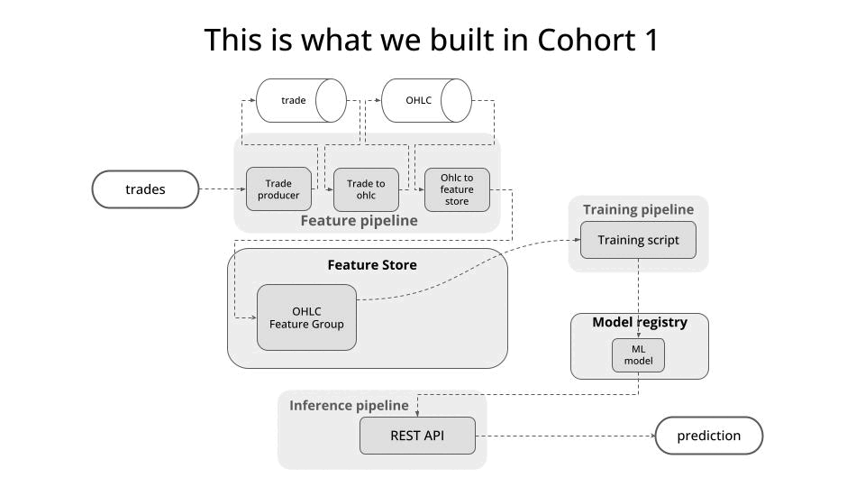

# Real_Time_ML_System

    

## Session 1 todos

- [x] Redpanda up and running
- [x] Push some fake data to Redpanda
- [x] Push real-time (real data) from Kraken

## Session 2

- [x] Extract config parameters
- [x] Dockerize it
- [x] Homework --> adjust the code so that instead of a single product_id, the trade_producer produces data for several product_ids = ['BTC/USD', 'BTC/EUR']
    My thoughts: you will need to update
        * the config types
        * the Kraken Websocket API class

- [x] Trade to ohlc service
- [x] Homework: Extract config parameters and dockerize the trade_to_ohlc service.

- [x] Topic to feature store service -> a Kafka consumer
- [ ] Start the backfill
    - [x] Implement a Kraken Historical data reader (trade producer)
    - [x] Adjust timestamps used to bucket trades into windows (trade_to_ohlcv)
    - [x] Save historical ohlcv features in batches to the offline store (topic_to_feature_store)

## Session 4

- [x] Dockerize our real-time feature pipeline
- [x] Dockerize our backfill pipeline and run it
- [ ] Build a functional training pipeline
      -[ ] Implement a class to read OHLC data from the feature store
      - [ ] Buid a dummy model to predict price into the future.

